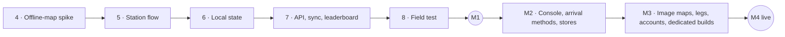

# Development Roadmap

**Version:** 1 · 2026-08-21 · companion to [design.md](design.md) (what we build) and [decision-log.md](decision-log.md) (why). Decisions this roadmap needs are registered there as D25–D32.

## 1. Where we stand

Steps 1–3 of the prototype are done: the bundle schema and validator, the repository, and the Expo app shell — umbrella home, themed venue home, track details, scanner, settings — verified on the web target. Nothing has run on a phone yet, nothing runs on a server yet, and there is no console. Those three facts order everything below. Platform scope is settled (D33): the prototype is Android-only; v1 ships on iOS and Android, and M2 opens by bringing the app up on iPhone.

Three rules carry over from the design:

1. **Risk first.** The step most likely to change the stack (offline maps) comes before anything that depends on it.
2. **Every step ends in something that runs** and has exit criteria that can be checked, not felt.
3. **Every decision is logged.** Open decisions are listed with the step that needs them, so none becomes a surprise.

## 2. Milestones at a glance

| Milestone | What it means | Exit criteria | Rough size |
|---|---|---|---|
| **M1 — Prototype demo-ready** | Steps 4–8 plus wrap-up | A party that has never seen the app completes the Spring Trail offline at a real venue; results reach the leaderboard when back online; a ten-minute demo runs clean; D14 and D18 revisited with data | 23–36 focused days |
| **M2 — Pilot-ready** | A first operator can author and run a real track, with our help | Operator staff author and publish a track in the console without code; GPS and QR arrival; umbrella app on TestFlight and Play internal testing; basic analytics | 40–62 days |
| **M3 — v1 complete** | Everything in design §12.2 | Custom image maps, multi-leg tracks, accounts, dedicated-build pipeline, full analytics, operational hardening | 31–46 days |
| **M4 — First operator live** | Public availability | Umbrella app public in both stores; the operator's track live with printed QR; launch checklist done | 5–10 days plus store review |

Sizes assume one developer pairing with Claude, in focused days, excluding waiting time (store review, account approvals, scheduling testers). See §8 before quoting them to anyone.

## 3. Prototype — steps 4 to 8

### Step 4 — Offline-map spike

**Why now.** This is the one step that can change the stack (D24). Until PMTiles renders offline on a device through the React Native MapLibre binding, no screen should be built on the map.

**Build.**

1. *Tile data.* Download a Protomaps planet build; `pmtiles extract --bbox` for the Spring Trail bounds at zoom 13–18; record the size. The same command is automated in the bundle builder in step 5.
2. *Style and offline assets.* A neutral basemap style (Protomaps "light") with the **glyph PBFs and sprite sheet bundled** — labels need fonts offline, and Hebrew place names need the Hebrew glyph ranges. This is the piece most often forgotten in offline-map work.
3. *Native binding.* `@maplibre/maplibre-react-native` with its Expo config plugin. This requires a **development build**, not Expo Go: `npx expo run:android` locally (Android Studio and the SDK on Windows). The prototype is Android-only (D33); iOS is brought up at the start of M2.
4. *Map component.* Camera clamped to the leg's bounds; station markers in four states (current, done, upcoming, locked); the party's position from foreground location only; straight-line distance and bearing to the current station.
5. *Web.* MapLibre GL JS with the `pmtiles` protocol for the dev web target, reading the extract over HTTP range requests.

**Exit criteria.** On an Android phone in airplane mode, with the extract already on the device: the map renders at zoom 13–18 inside the bounds; markers and the position dot show; the distance label updates while walking; panning outside the region degrades gracefully; the extract's size is recorded in design §8. iOS is not part of the prototype (D33).

**Risks and fallbacks.** The binding lacks `pmtiles://` support → MapLibre offline packs served from our own tile server (online at download time, offline after), or raster MBTiles. The extract is too large at zoom 18 → cap at 17 and tighten the bounds. Android toolchain friction on Windows → EAS cloud builds for Android.

**Decisions needed.** D29 build method; D25 to confirm or change the map stack afterwards.

**Size.** 3–5 days; still the widest variance on the list because of native tooling. *Done 2026-08-21 on an emulator, in one day; see spike-offline-map.md.*

### Step 5 — Station flow: the Spring Trail becomes playable

**Build.**

1. *`packages/game-core`* — pure TypeScript shared by the app now and the API in step 7: answer normalization and matching (design §4.4, including Hebrew vowel points, final letters, geresh, and typo tolerance); scoring (§4.5–4.6, provisional per D14); the session reducer over an **event log**, so events are the source of truth from the first day — step 6 only adds persistence and step 7 only adds upload; completion rules per order/visibility mode. Tests for all of it.
2. *`packages/bundle-builder`* — the CLI the README promised: validate with bundle-schema → snapshot → resize media to ≤ 1600 px → tile extract → zip with a manifest of sizes and hashes. Output goes under the app's `public/bundles/` and is served by the dev server until the API exists.
3. *Start flow* (`/t/[trackId]/start`): language → team name with suggestions and a Hebrew/English profanity list → safety notes acknowledged → download with size and progress → checksum verification → unpack into app storage.
4. *Play screens:* map or clue screen (Model A with distance feedback; the first station always a pin), "We are here", station intro blocks, the three challenge inputs, the hints drawer with costs shown before reveal, reveal-and-continue, correct and wrong feedback, the next-station reveal, the leg outro, and the local result card.
5. *Pin-capture screen (dev only).* Walk a site, tap to record each station's coordinates, export JSON. Step 8 needs it to re-pin the real venue, and it costs half a day now.

**Exit criteria.** The Spring Trail plays end to end offline on a device, in Hebrew and in English; no dead end exists anywhere (every challenge has hints or an immediate reveal); game-core tests cover matching, scoring, and every reducer transition; the owner plays it through once without touching the code.

**Decisions needed.** None new. D14 stays provisional until step 8 has data.

**Size.** 7–11 days. *Done 2026-08-21: game-core and the bundle builder (a real Spring Trail bundle builds at 4.15 MB); the app's start flow, play screen, result card, and dev pin-capture screen. The Spring Trail was played end to end on the emulator — download, verify, unpack, all seven stations (number, choice, text), hints, reveal-and-continue, scoring, the result card (700 points, 6:22), the leaderboard opt-in, and back-to-venue. Physical-phone play and offline (airplane-mode) play remain for step 8.*

### Step 6 — Crash-safe local state

**Build.** SQLite through `expo-sqlite`: `sessions`, `events` (append-only), `bundles`, `recent_venues`, `settings`. The append-then-apply rule: every state change writes its event before the state updates. Restore on launch; pause and resume; "Leave track"; a bundle cache with checksum verification and deletion from Settings; schema-version gating (the app supports the current version and the previous one; a newer bundle prompts an update); the language override and recent venues move from memory to storage.

**Exit criteria.** Kill the app mid-challenge with hints open → relaunch restores the exact state. An airplane-mode playthrough leaves a complete, ordered event log. The storage screen lists and deletes bundles. Starting a finished track again creates a new session and keeps the old one.

**Size.** 3–4 days. *Done 2026-08-21: `src/db/` (expo-sqlite; `sessions`, append-only `events`, `bundles`, `recent_venues`, `settings`; `user_version` migrations). Append-then-apply in `PlayProvider` (events persisted before state updates); restore-the-latest-unfinished-session on launch (re-read log → re-derive → reload bundle); monotonic-clock pause on background / resume on foreground, with a hard-crash re-anchor; the `/downloads` storage screen (list, size, delete, in-progress warning); language override and recent venues moved to the db; schema-version gating in the start flow. Verified on the emulator against every exit criterion: killing the app mid-challenge relaunched into the exact station state; the on-device event log is complete and monotonically ordered; the storage screen lists, warns about an in-progress game, and deletes; and starting again leaves a second session row while keeping the first. 88 tests pass.*

### Step 7 — Delivery and ingestion APIs, sync, leaderboard

**Build.**

- *`apps/api`* — Fastify in TypeScript on PostgreSQL (Drizzle, D26) with `tenants`, `tracks`, `track_versions`, `bundles`, `sessions`, `session_events`, `leaderboard_entries`. Endpoints: venue by slug, tracks by tenant, track by id, manifest, bundle download through object storage, event batches (idempotent by event id with a per-session sequence), leaderboard by window, session result. The server recomputes the score from events with game-core and flags mismatches.
- *App* — the HTTP delivery client replaces the fixture behind the same interface; a sync worker (queue → batch → acknowledge → prune, with backoff and a connectivity listener); the leaderboard view with opt-in and the "will be posted when you're back online" state.
- *Operations* — one hosted environment (D27): managed Postgres, object storage, HTTPS on the product domain (D31); a seed script that publishes Ein Dror from `content/`; CI that typechecks, tests, validates content, and builds on every push.

**Exit criteria.** A full offline play on a phone syncs when back online and appears on the leaderboard with the server-computed score; replaying the same batch changes nothing; the bundle is downloaded from the hosted API and verified; the demo environment is reachable from any network.

**Decisions needed.** D26 database tooling; D27 hosting; D31 product domain.

**Size.** 6–9 days. *Code done and verified locally 2026-08-21: `apps/api` (Fastify + Drizzle over Postgres — PGlite locally and for tests, node-postgres for a `DATABASE_URL`; all seven tables; every endpoint; idempotent ingestion that recomputes the score with game-core and flags mismatches; a seed that publishes Ein Dror). The app's HTTP delivery client (behind the same interface as the fixture), the sync worker (per-session high-water mark; triggers on foreground, after each event, and on launch), and the leaderboard view (window toggle, offline state, opted-in from the result card). 5 API integration tests plus the app; 93 across the repo. Verified end to end on the emulator: the app reads the venue/track and downloads+verifies the bundle from the API; a full playthrough with the API stopped buffers 35 events offline, and on reconnect they upload, the server computes the score (700), and "The Owls" appears on the leaderboard — replaying the batch changes nothing (idempotent by event id). One bug found and fixed: the device's monotonic clock reports fractional milliseconds, which the integer play-time column rejected until ingestion rounded it (regression test added). Hosting decided 2026-08-22 (D27: Render free tiers; D31 domain deferred to the go/no-go): bundle archives moved into Postgres (`bundle_objects`) so the service needs no disk or object-storage account; a free Render Postgres was created in Frankfurt (expires 2026-09-21) and seeded from a dev machine over TLS — the production driver path verified against the real database; `render.yaml`, `.github/workflows/ci.yml`, and `apps/api/scripts/render-deploy.mjs` are in place. An adversarial review (three lenses, two independent verifiers per finding; 14 confirmed) preceded exposure: it caught a clean-checkout build-order failure, CI never building bundle-builder, `http://` bundle URLs behind Render's proxy, a process-killing pg.Pool error, TLS forced on Render's private hostname, the sync client wedging on a 4xx, finishes only debounced, a UTC "today", malformed batches as 500s — and, substantively, that the "server-computed" score just re-added client-supplied points. All fixed: the score is now recomputed from the track's content, sessions are bound to the opening device, batches and logs are capped, profane names are hidden server-side, acks are contiguous; 102 tests, and the rewritten ingestion was smoke-tested against the hosted database. Deployed 2026-08-22: the repository is `github.com/shanytopper/riddler`; the Render web service `riddles-api` builds from it and is live at `https://riddles-api-vv2y.onrender.com` (health, venue, track, bundle, and leaderboard verified over the public internet); the app points at it. Hosted dry run on the emulator with the release APK: a clean install read the track from Render and downloaded the bundle from it; airplane mode on; all seven stations played offline; opted in on the result card while offline (Render's leaderboard still empty); airplane mode off and the app foregrounded — within five seconds "The Owls · 700" was on Render's leaderboard with the server-recomputed score, and the in-app leaderboard showed it. Step 7's exit criteria are met except the physical-phone playthrough, which moves to the field test (now step 9). Still owner-gated: the CI workflow file sits untracked until the GitHub token gets the `workflow` scope; D26 (Drizzle, as built) awaits formal confirmation.*

### Step 8 — Editor v0: the operator edits and publishes without JSON (D34)

**Why now.** The owner's call (D34): a prototype whose content can only be changed by editing JSON and running a script does not show an operator the product. The go/no-go demo needs the operator side, so a deliberately small console comes before the field test.

**Build.**

1. *Console foundation* — `apps/console`: a React + TypeScript single-page app (Vite) served by the API under `/console`; sign-in with the operator password (`CONSOLE_PASSWORD`) and a session cookie; English UI, Hebrew and English content fields side by side with RTL inputs.
2. *Track editor* — details and rules; the station list with reorder; the station editor: title, intro paragraphs, the challenge (number, choice, text) with type-specific fields, hints with costs, points, reveal and clue, arrival shown read-only (manual in the prototype).
3. *Map* — MapLibre GL JS on the public Protomaps build; drag each station's pin; the leg bounds shown.
4. *Validation and publishing* — drafts in Postgres (`track_drafts`); the validator's report with paths; Publish = version N+1, the bundle built on the server with the cached map artifacts (re-extract only when the bounds change), stored in Postgres, served to the app as the new published version.
5. *Leaderboard moderation* — list entries including hidden ones; hide and unhide.

**Exit criteria.** With the hosted environment: the owner signs in at `/console`, changes a question and a hint, drags a pin, runs validation, publishes; the app on the emulator or a phone downloads the new version and plays the changed content; a leaderboard entry can be hidden and reappears when unhidden.

**Decisions needed.** None new (D34 settled the shape).

**Size.** 6–9 days. *Done and verified end to end on the hosted service 2026-08-22. Server (`apps/api/src/editor`): a password check and an HMAC-signed session cookie; drafts in Postgres (`track_drafts`, seeded from the published version); a validator report; and Publish, which freezes the draft into version N+1, builds the bundle on the server reusing the map-artifact cache in Postgres, and points the track at it. Console (`apps/console`): a React + TypeScript SPA (Vite) served by the API under `/console` — sign-in, the details/rules form, a reorderable station list with the per-station editor (the three challenge types, hints, points, reveal), Hebrew and English side by side with RTL inputs, a MapLibre map with a draggable pin per station, the validation report, Publish, and leaderboard hide/unhide. Built during the Render deploy and served by the same free service; `go-pmtiles` is unpacked into the repo root during the build (`PMTILES_BIN`), and `CONSOLE_PASSWORD`/`COOKIE_SECRET` are set on the service (not in the repo). 19 API tests (6 for the editor) plus the console typecheck and build; the repo is prettier-clean. End-to-end against `https://riddles-api-vv2y.onrender.com/console`: signed in, changed a question (its answer preserved) and a hint, dragged a station pin, ran validation (clean), and published — the first console publish ran `go-pmtiles` on Render from a cold cache (the pre-refactor seed had stored no artifacts) and finished in ~23 s; the app-facing release then served `trackVersion` 2 and the downloaded archive carried all three edits; the artifacts persisted to Postgres, so a follow-up publish was ~4 s (cache hit, no extract). A leaderboard entry was hidden (it left the public board) and unhidden (it returned). One fix found in the browser during verification: maplibre-gl v6 loads its worker as a separate module (`maplibre-gl-worker.mjs`) that Vite did not emit, so the request fell through to the SPA fallback as `text/html` and the map dropped to main-thread rendering; a post-build step now copies the worker into `dist/assets`. The track was restored to the original content (published v3) and the draft cleared, so the operator starts from a clean Spring Trail. Exit criteria met. Still owner-gated: the CI file (which now also builds the console) stays untracked until the GitHub token gets the `workflow` scope. Follow-up (owner, after more testing, 2026-08-22): the console now also **creates a new track** — a `POST /console-api/tracks` seeds a valid one-info-station skeleton under the operator's venue (bounds copied from an existing track) and opens the editor — and **adds or removes stations** in the Stations tab (a leg always keeps at least one station). 21 API tests; verified end to end locally (create → add → remove → save → validate clean). Further follow-up (owner, 2026-08-22): each station now carries **its GPS location beside its description** — latitude/longitude fields and a per-station map with a draggable pin — and the separate Map tab is gone. The console map was blank because the browser can't range-request the public Protomaps build cross-origin; it now uses a plain raster basemap that loads reliably — OpenStreetMap streets or Esri satellite (toggle), fitting for placing a station on an outdoor trail.*

### Step 9 — Field test

**Prepare.** Choose the venue (D28) and re-pin the seven stations and the bounds with the pin-capture tool; add a cover photo and one photo per station; rewrite two or three challenges as observation questions about things testers can actually see; print the venue QR poster; assemble the device matrix (three Android phones of different makes and ages; no iOS in the prototype, D33); write the observation protocol: one observer per party, no help unless a party is stuck for five minutes, note every moment of confusion; timestamps come from the event log, not the observer.

**Run.** Three to five parties who have not seen the app: at least one family with children, one Hebrew-first and one English-first party.

**Afterwards.** Analyze the event logs (completion, time per station, hints and reveals, manual-arrival positions against the pins); write the fix list; revisit D14 and D18 with data; decide what "good enough to demo" means.

**Exit criteria.** At least 70 % of parties finish (design §1.3); no data lost; the revisited decisions are logged.

**Size.** 3–5 days plus scheduling.

### Prototype wrap-up — M1

A ten-minute demo script for operators (umbrella home → venue → track → two stations played → result and leaderboard; Hebrew and English; airplane mode on); the step 8 fixes; D14 and D18 decided; M2 and M3 re-estimated from actuals. Success metric from design §1.3: two of the first five operators shown agree to pilot.

**Size.** 1–2 days.

## 4. M2 — Pilot-ready

The gate to a paying pilot is the console: operators write their own content (D2, D3), so until they can, every track needs us. M2 also opens iOS: the prototype ran on Android only (D33), so the first work package brings the app up on iPhone before anything else is added. Work packages in dependency order:

| WP | Scope | Size |
|---|---|---|
| 0 — iOS bring-up | First EAS iOS build; MapLibre + PMTiles on iOS; RTL, fonts, camera, and location permissions verified on an iPhone; TestFlight internal testing | 3–5 d |
| A — Console foundation | Next.js; sign-in by email link and passkeys; tenant users with admin and editor roles; Hebrew and English UI with RTL | 4–6 d |
| B — Track editor | Details; legs and stations list; station editor; challenge editor with the accepted-answer tester (reuses game-core); hints; reveal settings; rules | 8–12 d |
| C — Map editor | Standard map with MapLibre GL JS; place and drag pins; radius; bounds with the estimated extract size shown live | 3–5 d |
| D — Translations, validation, preview | Side-by-side translation tab with completeness per language; the publish validation report; a phone-frame preview (D32) | 3–5 d |
| E — Publishing pipeline | Draft and published versions; the bundle builder as a server job (media resize, tile extract, upload); unpublish; version history | 4–6 d |
| F — Arrival methods and modes in the app | GPS radius with the accuracy rules of design §4.3; station QR scanning with offline token check; automatic arrival; all three order/visibility modes including the Model B and C flows | 4–6 d |
| G — QR print materials | Venue entry poster and station sheet as branded PDFs | 2–3 d |
| H — Analytics v1 | Ingestion rollups; console dashboard with sessions started, finished, abandoned, completion rate, per-station funnel, median time | 4–6 d |
| I — Store readiness | Umbrella app icon and splash; store listings in both languages; privacy policy and terms pages; TestFlight and Play internal testing; first review | 3–5 d plus review time |
| J — Privacy and retention | 13-month raw-event retention job; data map; in-app privacy notice; operator data-processing agreement template | 2–3 d |

**Exit.** An operator's staff author and publish a real track without us, and visitors play it through TestFlight or Play internal testing.

## 5. M3 — v1 complete

| WP | Scope | Size |
|---|---|---|
| K — Custom image maps | Upload; image-position editor; image-map rendering in the app with the same markers | 4–6 d |
| L — Multi-leg tracks | Leg editor; per-leg map artifacts marked deferred; between-legs screens; prefetch when online | 4–6 d |
| M — Challenge completeness | `multi_choice`; time bonus; wrong-choice penalty as decided in the D14 revisit; info stations | 2–3 d |
| N — Accounts | Sign in with Apple, Google, email link; history; leaderboard linking; self-service deletion | 4–6 d |
| O — Analytics, full | Most common wrong answers per challenge; hint usage by hint; manual-arrival flags; language and platform split; filter by version | 3–4 d |
| P — Dedicated builds | EAS profiles per tenant driven by the existing environment variables; asset slots; the operator developer-account runbook (App Store guideline 4.2.6); the console's "Dedicated app" page with release status | 4–6 d |
| Q — Platform admin | Tenant creation and invitations; audit log; support impersonation with logging | 3–4 d |
| R — Hardening | Monitoring and alerts; backups with a restore drill; rate limits; CDN in front of bundles; load test of event ingestion; crash reporting; an OTA update policy (EAS Update) | 4–6 d |
| S — Accessibility and polish | Dynamic type; screen-reader labels; contrast enforcement in the console's theme editor; empty and error states; store screenshots per language | 3–5 d |

**Exit.** Design §12.2 is true: every listed capability exists and is exercised by a second, fictional tenant (a dark-themed museum with a floor plan) alongside Ein Dror.

## 6. M4 — First operator live

A checklist, not a build: an onboarding session with the operator's content team; a content review against the validator's warnings; printed posters in place; day-one watch on the monitoring dashboard; a support path visitors can actually find; a two-week post-launch review feeding D14, D18, and the analytics backlog.

## 7. Cross-cutting workstreams

**Engineering hygiene.** CI from step 7 (typecheck, tests, content validation, app bundle build on every push); branch protection; release tags. End-to-end tests once the flows settle: Maestro for the play path after step 6, Playwright for the console in M2.

**Accounts and expenses, with the step that needs them.**

| Need | When | Note |
|---|---|---|
| Apple Developer Program | Before M2 work package 0 (first iOS build) | Organization enrollment takes days; start it a few weeks before M2 |
| EAS (Expo Application Services) | M2; optional earlier | Cloud builds for iOS from Windows; optional for Android during the prototype |
| Google Play Console | Before Play internal testing (M2) | One-time fee; prototype APKs are sideloaded |
| Domain, hosting, managed Postgres, object storage | Step 7 | Single EU region for the prototype |
| Email provider for sign-in links | M2 | Transactional email only |
| Protomaps data | Step 4 | Free extracts from the public builds; the hosted API is optional |

**Legal and privacy.** Privacy policy and terms in both languages (M2, before any store listing); retention; the minors statement from design §10; an operator data-processing agreement.

**Content.** Ein Dror stays the demo tenant. M3 adds a second fictional tenant with a dark theme and a floor plan, so image maps and theme variety are exercised before a real operator needs them.

**Documentation.** design.md remains the spec; the decision log remains the record; runbooks are added for dedicated builds and operator onboarding.

## 8. Estimates and how to use them

All sizes are focused developer-days for one developer pairing with Claude, and exclude waiting. The widest uncertainty sits in step 4 (native tooling), WP-0 (the first iOS run after an Android-only prototype), WP-B and WP-C (editor interaction design), and WP-I and WP-P (store processes outside our control). Totals: **prototype 23–36 days; M2 40–62; M3 31–46; M4 5–10** — roughly five to seven months of focused solo work to v1. Re-estimate twice: after step 5, when the app's real build cadence is known, and after WP-A, when the console's is.

## 9. Decision calendar

| When | Decision | Recommendation |
|---|---|---|
| Before step 4 | **D29** Build method | *Decided:* local Android development builds (Android Studio); EAS from M2 |
| Before M2 | **D30** Developer accounts | Apple Developer Program a few weeks before M2's iOS bring-up; Google Play Console before Play internal testing |
| After step 4 | **D25** Map stack | Confirm PMTiles + MapLibre, or adopt the fallback the spike showed |
| Before step 7 | **D26** Database tooling | Drizzle ORM with drizzle-kit migrations |
| Before step 7 | **D27** Hosting for the prototype | A small PaaS (Fly.io or Railway) + Neon Postgres + Cloudflare R2, one EU region |
| Before step 7 | **D31** Product domain | Buy a neutral domain now; the working name can stay |
| Before step 8 | **D28** Test venue and testers | A park reachable repeatedly; three to five parties including a family |
| After step 8 | **D14, D18** revisits | With event data |
| Before WP-D | **D32** Console preview approach | An HTML preview that mirrors the app's station screens; rendering the real components through react-native-web is a stretch goal |
| Before WP-I | Product name and umbrella branding | Owner's call; not a technical decision |

## 10. Not on this roadmap

By decision (D7, D15, D21, D23 and design §12.3): photo tasks and recaps, audio, AI-assisted authoring, languages beyond Hebrew and English, branching paths, a live map of sessions, push notifications, synchronized events, payments and self-signup, a marketplace, cross-device resume. They are listed so that "while we're at it" has somewhere to be refused.
