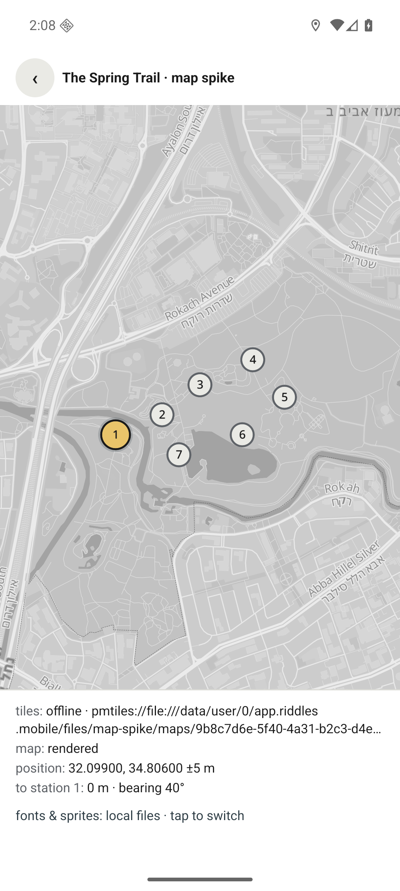

# Spike: offline map (step 4)

**Started:** 2026-08-21 · **Decides:** D25 (map stack) · **Scope:** Android only (D33), local development builds (D29)

The question: does the decided stack — MapLibre through `@maplibre/maplibre-react-native`, with a Protomaps PMTiles extract shipped inside the bundle — render the Spring Trail's map on a phone with the radio off, at an acceptable size? Until it does, nothing else is built on the map.

## What the documentation says (verified 2026-08-21)

- **The binding.** `@maplibre/maplibre-react-native` 11.3.6 supports only the New Architecture, lists `expo >= 54` as a peer, and is in use on Expo SDK 57 / React Native 0.86 according to its issue tracker. It cannot run in Expo Go; a development build is required. It bundles MapLibre Native Android 13.2.0 by default; the Expo plugin accepts `android.nativeVersion`, and the app pins **13.5.0** because 13.2 has an open crash in the PMTiles file source (maplibre-native #4459).
- **Local PMTiles.** MapLibre Native reads PMTiles natively since Android 11.8 / iOS 6.10. A local archive is addressed as `pmtiles://file:///absolute/path/to/file.pmtiles`. `pmtiles://asset://` does **not** work on Android (the asset source cannot do byte-range reads), so extracts must live in the app's files directory — which is where a downloaded bundle is unpacked anyway.
- **Fonts and sprites offline.** `file://` URLs are served by MapLibre's local file source for any resource kind, so the style's `glyphs` and `sprite` can point into the bundle directory. The Protomaps glyph files for _Noto Sans Regular_ and _Noto Sans Medium_ contain the full Hebrew block (range `1280-1535`); _Italic_ does not and is only used for water labels.
- **Tiles.** The public Protomaps builds (`https://build.protomaps.com/YYYYMMDD.pmtiles`, currently schema 4.15) go to zoom 15; MapLibre overzooms beyond that, so the content's `maxZoom: 18` is a display limit and the extract is cut at zoom 15. `pmtiles extract` works over HTTP range requests without downloading the 137 GB planet.
- **Style.** `@protomaps/basemaps` 5.7.2 generates the layer list for a given flavor and label language with no dependencies; the app assembles the style on the device (`src/map/style.ts`) so a bundle carries data, never a style file that could drift from the app's map version. Flavors: `grayscale` for the light scheme, `dark` for the dark one — neutral greys so the tenant's colors carry the UI.
- **Web.** `maplibre-gl` 6 is ESM-only and works with the `pmtiles` protocol; the dev web target uses it through `TrackMap.web.tsx`.

## What was built

| Piece                                                                                    | Where                                                                                        |
| ---------------------------------------------------------------------------------------- | -------------------------------------------------------------------------------------------- |
| Offline-asset contract: font stacks, glyph ranges per language, sprite files, build URLs | `packages/bundle-schema/src/map-assets.ts` (exported as `@riddles/bundle-schema/map-assets`) |
| Style assembly from the bundle's tiles, fonts, and sprites                               | `apps/mobile/src/map/style.ts`                                                               |
| Track map, native and web, with the same props, markers, and position layers             | `apps/mobile/src/map/TrackMap.tsx`, `TrackMap.web.tsx`, `markers.ts`, `types.ts`             |
| Source resolution: local bundle layout → fetch from the dev host → public build fallback | `apps/mobile/src/map/sources.ts`                                                             |
| Geometry: distance, bearing, bounds                                                      | `apps/mobile/src/map/geo.ts`                                                                 |
| Foreground position                                                                      | `apps/mobile/src/location/usePosition.ts`                                                    |
| Extract + glyphs + sprites tool                                                          | `tools/extract-map.ts` (`npm run extract-map`)                                               |
| Spike screen                                                                             | `apps/mobile/app/dev/map.tsx` → `/dev/map`                                                   |

## Verified on the web target (2026-08-21)

- The style assembles correctly: 39 schema-package tests and 18 app tests pass, including a test that every `text-font` the Protomaps layers reference (they switch fonts with `case` expressions) is one of the three bundled stacks, and that `lang: "he"` makes the layers read `name:he`.
- The dev screen (`/dev/map`) loads, resolves a remote source when no extract is present, and reports its state in a status strip.
- **MapLibre GL JS 6 on Metro needs its worker served explicitly.** The library loads its Web Worker from a module file next to itself via `import.meta.url`; under Metro that resolves to the entry bundle's folder and the browser receives Metro's HTML page ("Failed to load module script … text/html"). `apps/mobile/scripts/sync-web-assets.mjs` copies `maplibre-gl-worker` and `maplibre-gl-shared` into `public/vendor/maplibre/` before `expo start`, and `TrackMap.web.tsx` calls `setWorkerUrl()`. After the fix the worker is served as `application/javascript` with no errors.
- Tile rendering itself could not be observed in this session: the in-app browser pane was hidden, and MapLibre runs its style load and rendering on animation frames, which a hidden document never gets. Open the pane (or any browser at `/dev/map`) to see the Spring Trail area drawn from the public Protomaps build.

## Toolchain on the development machine (installed 2026-08-21)

Installed headlessly under the user profile — no system settings or persistent environment variables were changed:

| Tool                                    | Location                                          | Notes                                                                   |
| --------------------------------------- | ------------------------------------------------- | ----------------------------------------------------------------------- |
| Android SDK command-line tools 15859902 | `%LOCALAPPDATA%\Android\Sdk\cmdline-tools\latest` | Expo's default SDK lookup path, so `ANDROID_HOME` is not required       |
| Eclipse Temurin JDK 17.0.20             | `%LOCALAPPDATA%\Programs\jdk-17`                  | React Native 0.86 and Gradle 9.3 need JDK 17+                           |
| go-pmtiles 1.31.2                       | `%LOCALAPPDATA%\Programs\pmtiles\pmtiles.exe`     | `tools/extract-map.ts` finds it there, or on `PATH`, or via `--pmtiles` |

`apps/mobile/scripts/with-android-env.mjs` sets `JAVA_HOME`, `ANDROID_HOME`, and `PATH` for one command; `npm run android -w @riddles/mobile` and `npm run adb -w @riddles/mobile -- devices` go through it. The SDK packages themselves (platform 36, build-tools 36.0.0, platform-tools, NDK 27.1.12297006, as required by React Native 0.86) are installed with `sdkmanager` once the Android SDK license has been accepted.

## Emulator (API 36, x86_64) for checks that do not need a real walk

`npm run device -w @riddles/mobile -- <command>` wraps adb and the emulator with the toolchain environment: `avd-create` (one-time), `emulator` (headless; `--window` to watch), `wait-boot`, `screenshot out.png`, `geo <lat> <lng>` (moves the emulated GPS — walking the trail is a sequence of fixes), `airplane on|off`, `open dev/map`, `logcat`. The host machine is `10.0.2.2` from inside the emulator, which is what `apps/mobile/.env` points the asset download at. The helper starts the emulator on the host GPU (`--gpu host`, the default) because the software renderer draws everything except MapLibre's text. Real GPS behaviour and performance remain phone work.

## Results on the emulator (2026-08-21)

API 36 x86_64 emulator on the host GPU, debug build, with the Spring Trail extract downloaded by the app from the dev server into its files directory.

- The map renders from `pmtiles://file:///…/map-spike/maps/<legId>.pmtiles` (`tiles: offline`); station markers 1–7 with the current one in the tenant's accent; `map: rendered` fires.
- Labels render in Latin and Hebrew from the local glyph files — `file://` paths containing spaces (`Noto Sans Regular`) work: "Rokach Avenue / שדרות רוקח", "Ayalon South / איילון דרום".
- Position from `expo-location` at ±5 m; moving the emulated GPS from the Old Gate to the Spring updated the strip to "230 m · bearing 247°" and moved the position dot.
- Panning past the bounds: the camera stops at the region while the extract's coarser parent tiles keep drawing the surroundings.
- Airplane mode on, then leaving and re-entering the map screen: everything above still renders (`[map] local assets ready: 32 files`).
- **Release APK** (JavaScript bundled, no dev server), **cold-started with airplane mode on**: the map screen renders fully from local files, with no errors logged.

- Sizes: 2.05 MB of tiles plus 2.06 MB of fonts and sprites (9 glyph ranges × 3 stacks, two sprite flavors) — about 4.1 MB for the whole offline map.

Found and fixed along the way:

- **The software renderer (`-gpu swiftshader_indirect`) draws everything except text** and never reports the map fully rendered; labels appeared only after restarting the emulator with `-gpu host`, which is now the helper's default. Software rendering is not a valid way to judge MapLibre symbol layers.
- **Interrupted downloads left short files** that MapLibre rejected ("unknown pbf field type"). `sources.ts` now downloads to a `.part` file, checks the byte count against the server's Content-Length, and renames only on success.
- **Google's "Location Accuracy" dialog** (expo-location's `mayShowUserSettingsDialog`) made the position watch fail when declined; it is disabled — GPS alone is what the product relies on.
- **Tile data carries names in many scripts.** The default glyph set grew to Latin, combining diacritics and Greek, punctuation, and the Hebrew and Arabic presentation-form blocks, and Hebrew tracks also bundle Arabic. Ranges still absent (Georgian, Hangul, …) only drop those labels; the binding logs each as an error, which is noisy in development and harmless.
- A debug build cannot cold-start in airplane mode at all, because it fetches its JavaScript from the dev server; the cold-start check is done with the release APK, which is also what the field test's phones get.
- **Windows path length broke the release build.** CMake shortens object-file paths by hashing the source path, but only while the result fits its 250-character ceiling; the release variant's folder name (`RelWithDebInfo`) pushed React Native's autolinked code past it, CMake fell back to the full 352-character path, and ninja 1.10 (not long-path-aware, even with Windows long paths enabled) failed. `plugins/withShortNativeBuildDir.js` moves the CMake build tree to the repository root (`.cxx/`, gitignored) through the Expo config, so it survives `prebuild`.

## How to run the device test

1. **SDK packages** (one-time, after the license is accepted): `sdkmanager "platform-tools" "platforms;android-36" "build-tools;36.0.0" "ndk;27.1.12297006"` through the env wrapper. Enable developer mode and USB debugging on the phone; `npm run adb -w @riddles/mobile -- devices` must list it.
2. **Extract:** `npm run extract-map` writes `apps/mobile/public/maps/` (tiles for the Spring Trail leg, glyph ranges for Hebrew and English, light and dark sprites) and prints the sizes. _Done: see the exit criteria._
3. **Serve the assets to the phone:** `npm run start -w @riddles/mobile` serves `public/` from the dev server; set `EXPO_PUBLIC_MAP_ASSETS_URL=http://<your LAN IP>:8081/maps` in `apps/mobile/.env` so the app downloads the extract into its files directory on first run.
4. **Build and run:** `npm run android -w @riddles/mobile` (the first build downloads Gradle and dependencies and takes a while). Open `/dev/map` — from the app's home, the route is reachable with `npx uri-scheme open "riddles://dev/map" --android`.
5. **Airplane mode**, then reopen the screen: the status strip must say `tiles: offline` and `map: rendered`.

## Exit criteria (design.md §12.1, D25)

- [x] Map renders inside the bounds with the radio off — emulator, warm (airplane mode on, screen re-entered); release-APK cold start: see below
- [x] Station markers and the position dot show; labels render (Latin and Hebrew place names)
- [x] Distance to the current station updates while walking (emulated GPS fixes)
- [x] Panning outside the region degrades gracefully (camera clamped; coarser tiles beyond)
- [x] Tile extract size recorded: **2.05 MB** at zoom 0–15 (34 tiles) for the Spring Trail bounds from build 20260821; fonts + sprites: **1.02 MB** (4 glyph ranges × 3 stacks, two sprite flavors) — about 3 MB for a fully offline venue map, against the 50 MB budget
- [x] Glyphs load from `file://` paths containing spaces (`Noto Sans Regular`)
- [x] Release APK cold start in airplane mode renders the map
- [ ] The same on a physical Android phone, walking the real route (step 8)

## Open risks

- Glyph paths with spaces under `file://` are undocumented; see the last exit criterion.
- The Android PMTiles crash (#4459) was reported against remote sources on 13.2.0; 13.5.0 is pinned, but a local-file crash would send us to the offline-pack fallback.
- iOS is out of scope here (D33); when it arrives in M2, note maplibre-native #4443 (blank symbol layers with local glyph hosts on iOS) and re-verify fonts there.
- The bundle manifest does not yet list fonts and sprites as artifacts; step 5 adds them (additive, no schema version bump).
